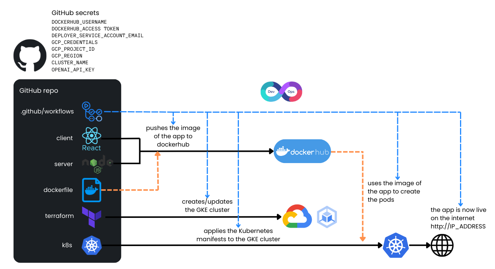

# Kubernetes Chatbot on GCP

> The cool thing about this project is not the chatbot itself—you can deploy any type of app. With just one push of a button, you can have your own containerized application up and running on GCP in minutes, fully accessible online and automatically scalable with Kubernetes!

This repository is a complete example of how to deploy an application (in this case, a ChatGPT-based chatbot) to Google Cloud Platform (GCP) using:

- **Node.js & React** to build the application.
- **Docker Hub** for container images (optional).
- **GitHub Actions** for CI/CD.
- **Terraform** to provision a GKE Autopilot cluster.
- **Kubernetes manifests** to deploy the containerized app.

## Deployment

On **every commit** to the `main` branch, the workflow will:
1. **Check out** the code.  
2. **Build & push** a Docker image to Docker Hub
3. **Provision or update** the GKE Autopilot cluster using Terraform.  
4. **Deploy** the container image and Kubernetes manifests to that cluster.  
5. **Wait** for the external IP, then post a comment with the link in a “Deployment Status” GitHub Issue.
- This means each time you push changes, the pipeline updates the GCP environment automatically.

## Prerequisites

1. **Google Cloud Account**  
   - [Create a GCP Account](https://cloud.google.com) if you don’t have one.
   - Create (or use) a **GCP project**.

2. **Service Account**  
   - In your GCP project, create a **service account** with the following roles:
     - **Compute Viewer**  
     - **Kubernetes Engine Admin**  
     - **Service Account Admin**  
     - **Service Usage Admin**  
   - Generate a **JSON key** for this service account:
     1. Go to **IAM & Admin** > **Service Accounts** in the GCP Console.
     2. Click on the service account.
     3. Click **Keys**, then **Add key** > **Create new key**.
     4. Choose **JSON** and download the file.
   - Save that JSON file locally; you’ll need its contents soon.

3. **(Optional) Docker Hub Account**  
   - If you want to build & push your own custom Docker image:
     1. [Create a Docker Hub account](https://hub.docker.com/) if you don’t have one.
     2. Create a **repository** (e.g., `username/kubernetes-chatbot`).
     3. Generate a **Personal Access Token** (in **Account Settings** > **Security** > **New Access Token**) with **read, write, delete** permissions.
   - If you prefer not to push your own images, you can skip this. The workflow will use a default image from this repo’s Docker Hub (but that means you won’t see your changes if you modify the code).

## Fork & Configure the Repository

1. **Fork this repo** into your own GitHub account. 
2. **Access the Secrets page**:
   - In your forked repo, go to **Settings** > **Secrets and variables** > **Actions**.
   - Click **New repository secret** for each of the following variables, named **exactly** as shown.

### Required Secrets

- **`DEPLOYER_SERVICE_ACCOUNT_EMAIL`**  
  - The email of the service account you created (e.g., `my-service-account@my-project.iam.gserviceaccount.com`).

- **`GCP_CREDENTIALS`**  
  - Paste the **entire JSON file** contents of your service account key into this secret.

- **`GCP_PROJECT_ID`**  
  - Your **GCP project ID** (e.g., `my-awesome-project`).

- **`GCP_REGION`**  
  - Your chosen GCP region, e.g. `europe-west1`.

- **`OPENAI_API_KEY`**  
  - Your **OpenAI API key** (retrieve from [OpenAI’s API page](https://platform.openai.com/account/api-keys)) so the chatbot can communicate with ChatGPT.

### Optional Secrets

- **`DOCKERHUB_USERNAME`**  
  - Your Docker Hub username. (e.g., `username`).

- **`DOCKERHUB_ACCESS_TOKEN`**
  - Your Personal Access Token password. (e.g., `dckr_pat_xxxx...`).

These are only needed if you want to **build and push** your own Docker image. If you skip them, the workflow will just deploy the default image.

## Deploying the Architecture

1. **Commit to main branch**  
   - After setting all secrets, any commit or push to the `main` branch triggers the workflow. A simple option is to edit the `README.md` file and push the change (do a false commit).

2. **Watch GitHub Actions**  
   - Go to **Actions** tab in your repo.
   - Click the latest workflow to see how the architecture is being built in real-time.
   - The first run may take up to 10 minutes (Terraform is creating the cluster).

3. **Check Deployment Status**  
   - Once it finishes, go to **Issues** > find **Deployment Status**.
   - Inside that issue, you’ll see a comment with the link to the newly deployed application.

4. **Access the App**  
   - Click the link from the comment, and you’ll see the **live chatbot** (or your own custom app) hosted on GKE!

## Making Changes

- **Modify the Chatbot or Build a Different App**  
  1. If you want a custom Docker image with your code changes, provide the **Docker Hub** secrets. 
  2. Commit your code changes to `main`.
  3. The workflow rebuilds/pushes your Docker image to your Docker Hub repo and redeploys it to GKE within a few minutes.

- **No Docker Hub?**  
  - You can keep using the default image from this repo’s Docker Hub if you only want to deploy the existing code.

## Conclusion

That’s it! You now have a **CI/CD pipeline** that:
- Creates or updates a GKE cluster in your own GCP project.
- Deploys a Docker container (this chatbot by default, or your own).
- Exposes it to the internet behind a LoadBalancer.
- Shows the external link in the **Deployment Status** issue whenever you push.

**Enjoy your scalable, auto-deployed app** powered by Google Kubernetes Engine! If you have questions or run into any issues, feel free to open a discussion or look at the logs in the **Actions** tab for troubleshooting. 

> **Happy Deploying!**  
> — Alfonso Monserrat